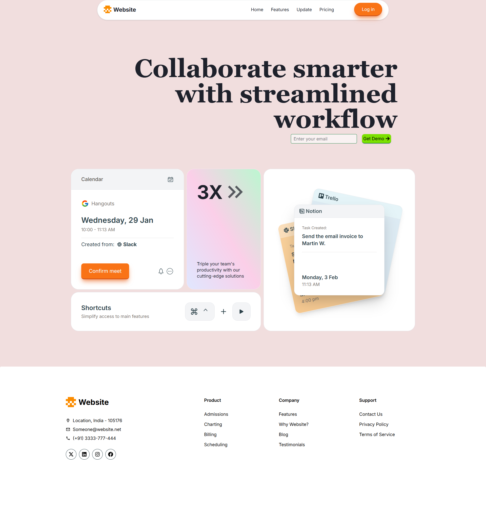

# My Landing Page Project (Next.js, TypeScript, React, Tailwind CSS)

This project is a landing page I built primarily to practice TypeScript and React. While I used Next.js for project setup, the focus here is front-end development. Think of it as a practical exercise in applying my TypeScript and React skills.

The design is modern and clean, leveraging the utility-first approach of Tailwind CSS. I've also incorporated some subtle animations using Framer Motion.

## Tech Stack

- **Next.js:** Used for project setup and static site generation.
- **TypeScript:** Used for type safety and code maintainability.
- **React:** The core UI library.
- **Tailwind CSS:** For styling. (tailwind op)
- **Framer Motion:** For animations.

## Next Steps

This is currently a front-end only project. Responsiveness is planned, but I'll be focusing on backend development next. I intend to revisit this project later to implement full responsiveness and potentially integrate backend functionality.

## Check it out!




and more animations stuff

## Getting Started

After cloning the repo, run the development server:

```bash
npm run dev
# or
yarn dev
# or
pnpm dev
# or
bun dev
```

Open [http://localhost:3000](http://localhost:3000) with your browser to see the result.

You can start editing the page by modifying `app/page.tsx`. The page auto-updates as you edit the file.

This project uses [`next/font`](https://nextjs.org/docs/app/building-your-application/optimizing/fonts) to automatically optimize and load [Geist](https://vercel.com/font), a new font family for Vercel.

## Learn More

To learn more about Next.js, take a look at the following resources:

- [Next.js Documentation](https://nextjs.org/docs) - learn about Next.js features and API.
- [Learn Next.js](https://nextjs.org/learn) - an interactive Next.js tutorial.

You can check out [the Next.js GitHub repository](https://github.com/vercel/next.js) - your feedback and contributions are welcome!
